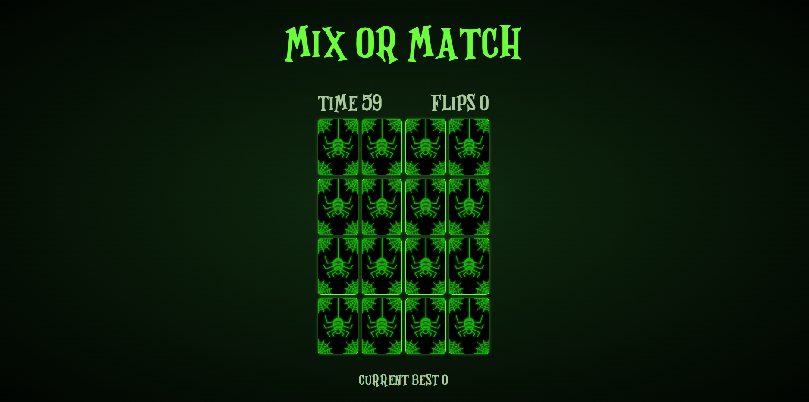
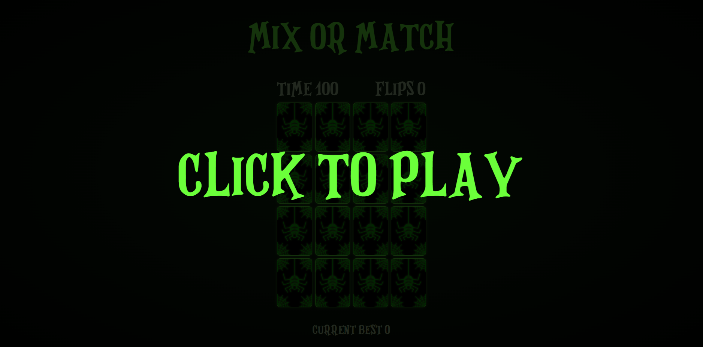
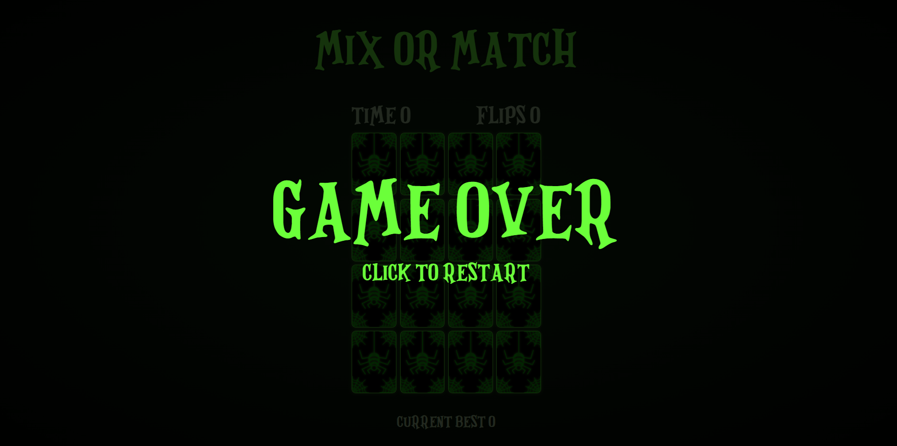
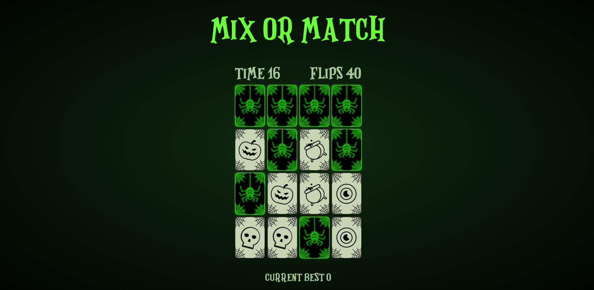
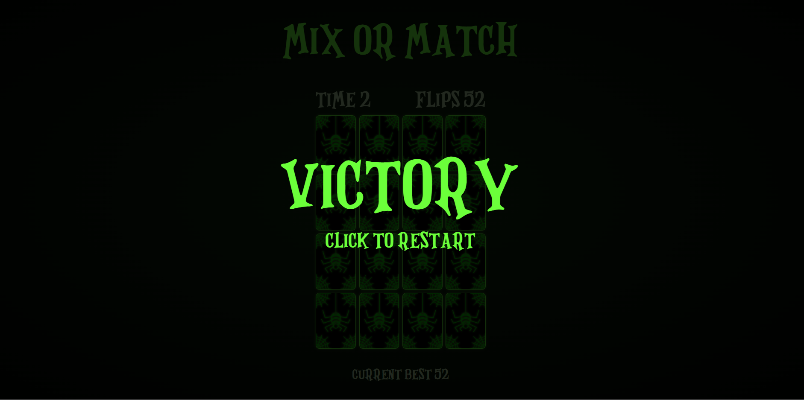

# Mix or Match

Spooky memory card game . Flip two cards at a time, if they are matching cards, you progress into the game, if not the cards face hide again and you have to remember the position of the cards you flipped, you get a limited set of time to get all the 16 cards matching, if you get it under 60 seconds you win or you lose.

## HOW TO PLAY

1. Click on "Click to play" pretty self explanatory
2. Flip two cards, if they match, they stay visible and you progress.
3. If they dont match, they hide again.
4. Try to remember the positions of the card you flip, so you can match the cards in the least number of flips.
5. Match all the card under 60 seconds and you win.
6. Try to get your best score, perfect score would be 16 which definitly is impossible until you are some sort of magician.

## ABOUT

so i wanted to make a spooky memory card game, the css was still manageable but the script had too many functions and one wrong thing would crash the whole thing, luckily i found a tutorial which helped me alot, i took the assets from there as well, i changed the font to my liking, coding the logic was really challenging and kinda fun for me, i learnt many new things, and slowly im getting more confident at my javascript skills. I was confused between 2 color schemes, orange the classic halloween or green which gives like a scary halloween color to me atleast, i went with greenish color schemes with black background and changed the card colors too since the art was in , also theres a cute cursor which changes when you hover the cards. It also has few animations when you hover onto the card or flip the card, and it plays a spooky sound at various instances of the game which are very spoooky. Later i added BEST SCORE which saves users best score locally, i think it was pretty essential for making the game a bit competitive, i also wanted to add a easy medium hard mode with varying time constraints but the time was limited since the submissions were closing in few hours maybe i will add in the future. i also learned a new shuffling algorithm called the "fisher and yates shuffle" what it does is it shuffles a finite sequence. the algorithm takes a list of all the elements of the sequence by randomly drawing an element from the list until no elements remain. the algorithm produces an unbiased permutation, every permutation is equally likely. what it basically does is take the array a of n elements, for loop i from n-1 down to 1 and then generates an random integer j which then becomes the indices of our array to shuffle it randomly, then we exchange a[j] and a[i]. it was a good learning experience, it was my first game which was this complex with all these classes and functions.

# SCREENSHOTS

